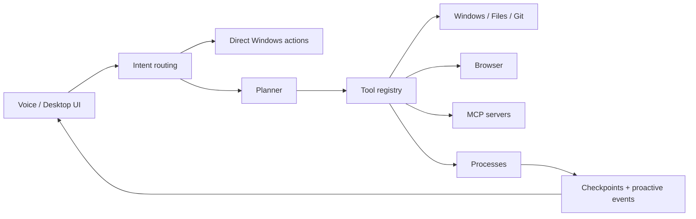

<div align="center">

# Rynne

### Tell it what needs to be done. Rynne figures out which windows, files, and tools it needs.

**A local-first Windows OS agent that does more than answer — it acts on your computer.**

[](#quick-start)
[](#quick-start)
[](#verification)
[](#control-and-safety)

[Website](https://rynne-web.vercel.app/) · [Download for Windows](https://github.com/KremlevLev/Rynne/releases/latest)

**English** · [Русский](README.ru.md)

</div>


<div align="center">

**Voice · windows · files · terminal · browser · memory · MCP · background plans**

</div>

---

## Not another chat. An operator.

With a regular assistant, you describe a task, get a set of instructions, and still do the work yourself. Rynne takes a goal, selects the right tools, executes the steps, and shows you a verifiable result.

> **“Open the project, run its tests, show me the failures, and keep the process alive while I work on something else.”**

Rynne can open applications, work with files, run commands in the background, monitor processes, resume durable plans after a restart, and notify you when the result is ready.

| Regular AI chat | Rynne |
|---|---|
| Tells you where to click | Clicks through APIs or UI Automation |
| Gives you a terminal command | Starts and monitors the process |
| Forgets the task after closing | Persists background-plan checkpoints |
| Only sees the prompt | Works with windows, files, browsers, and MCP |
| Says “I can't” before looking for a path | Searches its capability registry and reports only a real blocker |

## One sentence → a finished workflow

```text
You:  “Start the project, run the tests, and tell me if the server goes down.”

Rynne: understands the goal
      → selects terminal and process tools
      → starts the work in the background
      → persists its state
      → monitors the tests and server
      → comes back with the result
```

You do not need to remember tool names or manually assemble command chains. Describe the outcome in plain language.

## What Rynne can do today

### Operate Windows

- Open one application or a whole batch of them.
- Minimize and close windows, manage window placement, and change volume.
- Find UI elements through Windows UI Automation and interact with them.
- Read on-screen text through OCR.
- Accept voice commands from the UI or with `Ctrl+Shift+Space`.

```text
“Open Notepad, Calculator, and File Explorer.”
“Find the Save button in the active window and click it.”
“Read the text currently visible on screen.”
```

### Work like an engineering agent

- Infer the active Git workspace from your IDE, terminal, and files.
- Run relative terminal, file, and Git operations in that workspace.
- Read, create, and patch files with backups and diffs.
- Undo Rynne's last file change without overwriting newer manual edits.
- Inspect Git status, diffs, logs, and branches, and create commits.
- Start tests, commands, servers, and long-running processes.
- Read stdout/stderr, run health checks, and stop complete process trees.
- Drive a persistent Chrome or Edge profile for browser tasks.

```text
“Run the tests here.”
“Undo Rynne's last change.”
“Show me the project diff and suggest a commit title.”
“Run python -m pytest in the background and report the result.”
“Start an HTTP server on port 8000 and watch it.”
```

### Remember and continue

- Store long-term facts locally in SQLite.
- Create multi-step foreground and background plans.
- Save a checkpoint after every verified step.
- Resume unfinished work after restart without repeating side effects.
- Create reminders and monitoring rules.

### Split complex work across a model team

- Rynne automatically recognizes multi-part engineering and research requests.
- Independent intent, architecture, and verification workers run in parallel.
- Concurrency follows healthy independent Groq, OpenRouter, and Gemini key quotas,
  up to the configurable `NOVA_MAX_SUBAGENTS` limit.
- A reviewer merges the reports without changing the original request; the primary
  Rynne remains responsible for real tool calls, permissions, and verification.

```text
“Remember that my work repositories are in D:\Projects.”
“Run this in the background: open the project, test it, and prepare a report.”
“Remind me in 20 minutes to check the build.”
```

### Be proactive without taking over

The opt-in **Rynne Nearby** mode occasionally inspects only the active window. When it notices a clear problem or useful opportunity, it can ask:

> “It looks like the build failed. Want me to investigate the error?”

Accepting the suggestion turns it into a normal user request. Account creation, sending a message, publishing content, or any other external side effect still goes through the regular orchestrator, preview, and permission policy. The observer itself never receives action tools.

Rynne can also notify you when:

- a background plan or test run finishes;
- a managed server stops;
- CPU or memory remains overloaded across several samples;
- disk space runs low;
- a one-shot process stays alive suspiciously long;
- a Git repository has conflicts or stale uncommitted changes;
- a failed plan can safely resume from its latest checkpoint;
- a repeated sequence may be worth saving as a workflow;
- a tracked public webpage changes;
- a backup disappears or becomes stale;
- a watched Python package receives an update.

Notifications have cooldowns, importance levels, quiet hours, and an explicit explanation. Proactive observation proposes an action; it does not silently execute a new side effect.

```text
“Watch https://example.com/releases and tell me when it changes.”
“Watch D:\Backups and warn me if the backup is older than 24 hours.”
“Watch the requests package for updates.”
```

## Why Rynne says “I can't” less often

Every built-in and MCP tool is registered in a shared capability registry. The router selects capabilities from task intent instead of asking one model to guess every possible action at once.

- Common Windows commands can execute directly without an unnecessary LLM call.
- Complex tasks enter a multi-step tool loop driven by actual tool results.
- MCP tools join the same registry as native tools.
- Tool errors return as structured results and can trigger another route.
- Rynne reports inability only after it has exhausted applicable tools or encountered a real permission/environment blocker.
- Risky actions always pass through the permission policy.

## Models, providers, and routing

For Groq, routing is intentionally limited to two models:

| Request | Model |
|---|---|
| Text, reasoning, and tool calling | `openai/gpt-oss-120b` |
| Requests with an image | `qwen/qwen3.6-27b` |

Rynne also supports OpenRouter and Google Gemini as independent provider routes. Settings can hold an unlimited pool of keys for each provider. Keys are masked in the UI, rotated on limits or transient failures, and stored only in the current user's application data.

Groq is also used for cloud speech recognition when configured. Rynne does not route text tool calls to an unsuitable small model merely to claim fallback coverage.

## Install on Windows

For a normal installation you only need one file:

```text
Rynne_1.0.0_x64-setup.exe
```

Run it with a regular double click. Rynne installs for the current Windows user, appears in the Start menu and Installed Apps, and does not require Python, Node.js, or Rust on the user's machine.

On first launch, open **Settings** and add one or more Groq, OpenRouter, or Gemini API keys. Rynne stores them in its user data directory and reconnects Core automatically.

The desktop app includes three presentation modes:

- **Aura** — the full atmospheric UI with activity and context panels.
- **Focus** — a compact layout with more room for conversation.
- **Console** — a clean, dense, CLI-inspired workspace.

The whole desktop interface is available in **English and Russian**. Use the language
switcher in the top bar or Settings; Rynne remembers the choice and even localizes the
startup screen before React loads. Open **Guide** for an eight-part handbook with real
commands, voice and Rynne Nearby setup, skills, providers, MCP, safety, and troubleshooting.

Voice output is configured independently from the interface language. Settings includes
Auto/Russian/English routing, a 0.7–1.6× speed control, five offline Russian Silero voices,
six English Groq Orpheus voices, expressive styles, and a preview button for every voice.
Groq receives its native numeric speed parameter; local Silero uses native SSML prosody
steps (`x-slow` through `x-fast`). Rynne never speeds up an already rendered recording, so
changing the rate does not introduce the metallic post-processing effect. The lightweight
split is deliberate: Russian speech stays local, while English synthesis uses the existing
Groq key pool without loading a second neural model into laptop memory.

## Quick start from source

### 1. Clone Rynne

```powershell
git clone https://github.com/KremlevLev/nova.git
cd nova
```

### 2. Create the environment

```powershell
py -3.14 -m venv .venv
.\.venv\Scripts\Activate.ps1
python scripts/install_dependencies.py
```

Rynne's browser agent uses an installed Chrome or Edge browser with a dedicated persistent profile. A separately downloaded Playwright Chromium is not required for normal desktop use.

### 3. Add provider keys

```powershell
Copy-Item .env.example .env
```

Minimal configuration:

```env
GROQ_API_KEYS=gsk_your_key
```

You can also configure pools for all supported providers:

```env
GROQ_API_KEYS=gsk_key_one,gsk_key_two
OPENROUTER_API_KEYS=sk-or-key_one,sk-or-key_two
GEMINI_API_KEYS=AIza_key_one,AIza_key_two
```

Create a Groq key at [console.groq.com](https://console.groq.com/keys).

### 4. Run Rynne Core

```powershell
python -m main
```

Press **`Ctrl+Shift+Space`** and say:

> **“Open Notepad and write: Rynne is working.”**

## Hotkeys

| Shortcut | Action |
|---|---|
| `Ctrl+Shift+Space` | Start or stop a manual voice session |
| `Esc` | Interrupt Rynne's speech |
| `Ctrl+Shift+Q` | Emergency speech interruption |

## Desktop development

### Logs and bug reports

Installed desktop logs are stored in `%LOCALAPPDATA%\ai.nova.desktop\logs`.
Use **Settings → Diagnostics → Open log folder** to open it. `rynne-core.log`
contains the combined Core history, `rynne-desktop.log` contains supervisor
events, and `sessions\rynne-core-*.log` contains one immutable log per Core
launch. For a complete safe bundle run `scripts\collect-diagnostics.ps1`; it
creates a ZIP on the Desktop and excludes `.env` and API keys.

For a clickable browser-only UI preview:

```powershell
cd apps\desktop
npm install
npm run dev
# open http://127.0.0.1:1420/?demo=1
```

Without `?demo=1`, a browser preview correctly reports that Tauri Core is unavailable.

For the complete native desktop application:

```powershell
cd C:\Users\you\path\to\rynne
.\scripts\dev-desktop.ps1
```

This command discovers the local Vosk model, enables the wake word when available, launches Vite, opens the native Tauri window, and starts Python Core. Install the small Russian Vosk model once with `python -m vosk_install`, or let the launcher do it with `.\scripts\dev-desktop.ps1 -InstallWakeWord`.

Check the microphone, audio format, and Vosk runtime without launching Rynne:

```powershell
python scripts\voice_diagnostics.py
python scripts\voice_diagnostics.py --listen 20
```

Do not run `npm run dev` separately at the same time because both processes would compete for port `1420`.

### Build the Windows installer

Install build dependencies once:

```powershell
python -m pip install -r requirements-build.txt
cd apps\desktop
npm install
```

Then build:

```powershell
$env:Path = "$env:USERPROFILE\.cargo\bin;$env:Path"
npm run installer
```

The build compiles React, packages headless Python Core with PyInstaller, compiles the Tauri release shell, and creates:

```text
apps\desktop\src-tauri\target\release\bundle\nsis\Rynne_1.0.0_x64-setup.exe
```

Core uses a source fingerprint, so repeated builds skip PyInstaller when Python Core has not changed. Force a clean Core package with:

```powershell
npm run build:core -- --force
```

See [`docs/desktop_architecture.md`](docs/desktop_architecture.md) for the architecture and packaging boundary.

## MCP: connect the services you use

### Telegram Business Bot (recommended)

Create a bot with `@BotFather`, enable its Business Mode, connect it to your
Telegram account, and paste the Bot Token in **Settings → Integrations**. Rynne
then receives permitted new business messages, keeps a local searchable cache,
and can reply on behalf of the connected account according to the selected permission mode. The Bot
API does not expose arbitrary old history: a chat appears after a new message
is observed through the connection. The same settings screen accepts a Tavily
API key for higher-quality web search.

### Always-on Telegram Remote (optional cloud relay)

Rynne can use a private `rynne-cloud` deployment as an always-available Telegram
webhook and task queue. The bot keeps answering `/status`, `/tasks`, `/last`,
`/cancel`, and `/devices` while the PC is offline. Plain-text tasks wait in the
queue and are picked up when Core reconnects. Core only makes outbound HTTPS
requests; the relay cannot bypass local permission policy or execute Windows
tools itself.

Rynne Remote also supports persistent Missions. For example,
`/schedule daily at 09:00 | send system status` remains stored while the PC is
offline and enters the normal Core permission and verification pipeline after
reconnecting.

```env
RYNNE_CLOUD_REMOTE_URL=https://your-private-relay.vercel.app
RYNNE_CLOUD_DEVICE_ID=windows-primary
RYNNE_CLOUD_DEVICE_TOKEN=replace-with-the-device-token
```

### Personal Telegram through MCP (advanced)

Rynne ships an optional local Telegram MCP adapter for your real account. It can
list and search chats, read recent history and send a confirmed message without
guessing screen coordinates. Authorize it once, then restart Core:

```powershell
py -m pip install -r requirements.txt
py scripts/setup_telegram_mcp.py
```

The session stays on this PC. Reading is silent; sending always shows a Rynne
confirmation card before anything leaves your account. Opening a visible chat
still uses the Chrome skill, so API access and on-screen navigation complement
instead of confusing each other.

Rynne supports `stdio`, Streamable HTTP, and legacy SSE through the official MCP Python SDK. Save a standard `mcpServers` configuration:

```env
NOVA_MCP_CONFIG=C:\Users\you\.config\nova\mcp.json
NOVA_MCP_AUTO_DISCOVERY=false
```

```json
{
  "mcpServers": {
    "project_files": {
      "command": "python",
      "args": ["C:\\tools\\project_server.py"],
      "env": {
        "PROJECT_TOKEN": "${PROJECT_TOKEN}"
      }
    },
    "internal_api": {
      "transport": "streamable_http",
      "url": "http://127.0.0.1:8000/mcp"
    }
  }
}
```

After the handshake, tools receive risk/category metadata and join the shared capability router. `${ENV_NAME}` values are substituted locally and never added to the prompt.

## Teach Rynne a workflow without rebuilding it

Rynne loads contextual Markdown skills on demand from `%USERPROFILE%\.nova\skills`,
`<workspace>\.nova\skills`, and the compatible `<workspace>\.agents\skills` path.
Create `SKILL.md` in a subdirectory:

```markdown
---
name: Release Project
triggers: [release, publish version]
paths: [package.json, pyproject.toml]
tools: [read_text_file, apply_text_patch, run_project_tests, git_commit]
---
Read the current version, run the closest tests, update the changelog, then
create a commit. Never publish when tests fail.
```

Only matching skills enter the model context. Project skills override global
ones with the same name and update immediately after saving; declared tools are
loaded from the capability registry. Skills cannot override Rynne's policy,
permissions, confirmations, or the user's explicit goal.

## Control and safety

An OS agent should be capable, but it must remain predictable.

- Risky operations require confirmation.
- Generated Python executes inside a sandbox.
- Writes to protected system locations are restricted.
- A fallback route never repeats a side effect that already succeeded.
- Background actions and proactive suggestions are journaled.
- Rynne Nearby is opt-in; screenshots remain in memory during observation.
- When you accept visual help, context becomes a one-use attachment and is deleted immediately after the agent reads it.
- Password managers, banking, payment, and private-browsing windows are skipped automatically.
- On-screen content is treated as untrusted and checked for prompt injection.
- MCP auto-discovery is opt-in.
- Secrets remain in `.env`, environment variables, or the user app-data key store.

Example proactive controls:

```env
NOVA_PROACTIVE_QUIET_START=22
NOVA_PROACTIVE_QUIET_END=8
NOVA_PROACTIVE_DISK_FREE_PERCENT=10
NOVA_PROACTIVE_DISK_FREE_GB=5
NOVA_PROACTIVE_SYSTEM_CHECK_SECONDS=15
NOVA_PROACTIVE_CPU_PERCENT=90
NOVA_PROACTIVE_MEMORY_PERCENT=88
NOVA_PROACTIVE_SYSTEM_CONSECUTIVE_SAMPLES=4
NOVA_PROACTIVE_VISION_CHECK_SECONDS=90
NOVA_PROACTIVE_VISION_MIN_CONFIDENCE=0.78
NOVA_PROACTIVE_STALE_PROCESS_HOURS=4
NOVA_PROACTIVE_REPOSITORY_CHECK_SECONDS=60
NOVA_PROACTIVE_UNCOMMITTED_MINUTES=30
NOVA_PROACTIVE_RESUME_PLAN_MINUTES=15
NOVA_PROACTIVE_WORKFLOW_LOOKBACK_DAYS=14
NOVA_PROACTIVE_WORKFLOW_MIN_REPETITIONS=3
NOVA_PROACTIVE_WEBSITE_CHECK_SECONDS=300
NOVA_PROACTIVE_BACKUP_CHECK_SECONDS=300
NOVA_PROACTIVE_PACKAGE_CHECK_SECONDS=21600
NOVA_PROACTIVE_DISABLED_KINDS=disk_space_low,tests_completed
```

## Architecture



```text
nova/
├── apps/
│   └── desktop/       React/TypeScript UI and Tauri Windows shell
├── core/              configuration and system rules
├── modules/
│   ├── agent/         plans, background tasks, proactive engine
│   ├── application/   request pipeline and reports
│   ├── audio/         STT and TTS
│   ├── brain/         LLM gateway and model routing
│   ├── browser/       Chrome/Edge browser automation
│   ├── storage/       SQLite, memory, checkpoints, artifacts
│   ├── tools/         registry, runner, policies
│   ├── ui/            desktop protocol and legacy fallback UI
│   └── windows/       processes, files, Git, UIA, OCR
├── tests/
├── main.py
└── roadmap.md
```

The language boundary is intentional: React and TypeScript own presentation, Tauri owns the native window and installer, Python owns the AI agent, and Go is reserved for workers whose performance profile actually justifies it.

## Verification

```powershell
python -m pytest tests/ -q
cd apps\desktop
npm test
npm run build
python -m tests.orchestrator_acceptance
```

Current regression suite: **887 Python tests + 24 desktop tests + 8/8 orchestrator acceptance scenarios**.

The acceptance suite exercises the production selector, tool schemas, capability registry, policies, runtime validation, and execution events without consuming provider credits. Add every new capability to `GOLDEN_SCENARIOS` in [`tests/orchestrator_acceptance.py`](tests/orchestrator_acceptance.py).

## Project status

Rynne is under active development. The Windows tools, durable background plans, MCP layer, React/Tauri desktop app, memory, provider pools, browser profile, proactive safety model, and read-only parallel subagent teams are already implemented. The next major areas are isolated worktrees for parallel code-writing agents, broader proactive scenarios, richer task screens, signed releases, and automatic updates.

The detailed backlog and completed milestones live in [`roadmap.md`](roadmap.md).

## License

Rynne releases that include the current [`LICENSE`](LICENSE) are available under the **Functional Source License 1.1, Apache 2.0 Future License** (`FSL-1.1-ALv2`). Personal use, internal use, education, research, modification, and redistribution for permitted purposes are allowed. Offering Rynne or substantially similar functionality as a competing commercial product or service is not allowed under the FSL grant.

This licensing model applies to covered versions first made available on or after **August 10, 2026**. Each covered version becomes available under the Apache License 2.0 on the second anniversary of the date that version was first made available. Earlier versions released under Apache 2.0 remain under their original license.

See [commercial licensing](COMMERCIAL-LICENSE.md) to request competing-product, managed-service, OEM, or white-label rights. The proposed boundary between the useful public desktop agent and private Rynne Cloud infrastructure is documented in [open-core and private-service boundaries](docs/open-core-boundaries.md).

If you want a Windows agent that can do more than rephrase a task — try Rynne on a real workflow and tell us where it saved you time and where it got in the way.
