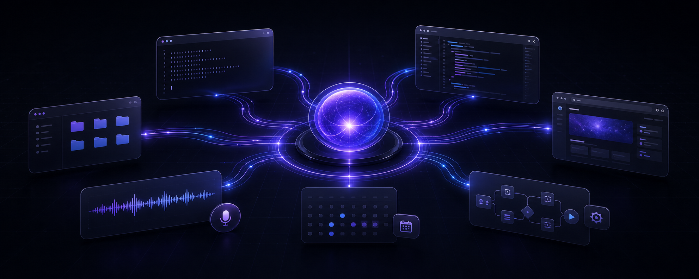
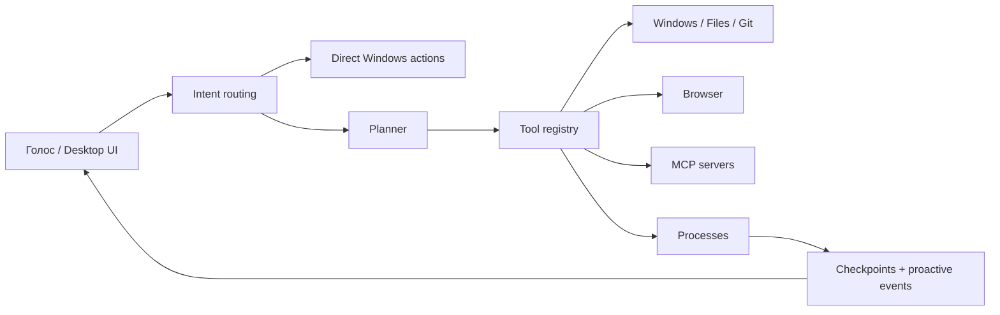

<div align="center">

# Nova

### Скажи, что должно быть сделано. Nova разберётся, какие окна, файлы и инструменты для этого нужны.

**Локальный OS-агент для Windows, который не просто отвечает — он действует на вашем компьютере.**

[](#быстрый-старт)
[](#быстрый-старт)
[](#проверка)
[](#контроль-и-безопасность)

</div>



<div align="center">

**Голос · окна · файлы · терминал · браузер · память · MCP · фоновые планы**

</div>

---

## Не ещё один чат. Исполнитель.

Обычному ассистенту вы объясняете задачу, получаете инструкцию и всё равно
делаете работу сами. Nova получает цель, выбирает подходящие инструменты,
выполняет шаги и показывает, что получилось.

> **«Открой проект, запусти тесты, покажи ошибки и не потеряй процесс, пока я
> занимаюсь другим».**

Nova может открыть приложения, работать с файлами, запустить команду в фоне,
следить за процессом, продолжить план после перезапуска и сообщить, когда
результат готов.

| Обычный AI-чат | Nova |
|---|---|
| Пишет, куда нажать | Нажимает через API или UI Automation |
| Даёт команду для терминала | Запускает и контролирует процесс |
| Забывает задачу после закрытия | Сохраняет checkpoints фоновых планов |
| Видит только prompt | Работает с окнами, файлами, браузером и MCP |
| Говорит «не могу» без доступного действия | Ищет подходящий инструмент и объясняет реальный blocker |

## Одна фраза → законченный workflow

```text
Вы:   «Запусти проект, прогони тесты и скажи, если сервер упадёт»

Nova: понимает цель
      → выбирает terminal + process tools
      → запускает работу в фоне
      → сохраняет состояние
      → следит за тестами и сервером
      → возвращается с результатом
```

Не нужно помнить названия инструментов или вручную собирать цепочку команд.
Вы описываете результат человеческим языком.

## Что Nova уже умеет

### Управлять Windows

- Открывать одно или сразу несколько приложений.
- Сворачивать и закрывать окна, менять громкость.
- Находить элементы интерфейса через UI Automation и нажимать их.
- Распознавать текст на экране через OCR.
- Принимать голосовую команду по `Ctrl+Shift+Space`.

```text
«Открой блокнот, калькулятор и проводник»
«Найди кнопку “Сохранить” в активном окне и нажми её»
«Распознай текст на экране»
```

### Работать как инженерный агент

- Читать, создавать и изменять файлы с backup и diff.
- Проверять Git status, diff, log, ветки и делать commit.
- Запускать команды, тесты и долгоживущие процессы.
- Читать stdout/stderr, проверять health и останавливать дерево процессов.
- Управлять Playwright-браузером.

```text
«Покажи изменения в проекте и предложи название коммита»
«Запусти python -m pytest в фоне и покажи итог»
«Подними HTTP-сервер на 8000 и следи, чтобы он не упал»
```

### Помнить и продолжать

- Хранить долговременные факты локально в SQLite.
- Создавать многошаговые и фоновые планы.
- Сохранять checkpoint после каждого подтверждённого шага.
- Продолжать незавершённый план после перезапуска без повтора side effects.
- Создавать напоминания.

```text
«Запомни, что рабочие репозитории лежат в D:\Projects»
«Запусти в фоне план: открой проект, прогони тесты, собери отчёт»
«Напомни через 20 минут проверить сборку»
```

### Быть проактивной, но не самовольной

Nova сообщает, когда:

- завершился фоновый план или тесты;
- упал управляемый сервер;
- на диске заканчивается место;
- одноразовый процесс подозрительно долго остаётся запущенным;
- в Git появился конфликт или изменения давно не закоммичены;
- failed-план можно безопасно продолжить с последнего checkpoint.

Уведомления имеют cooldown, quiet hours, уровень важности и объяснимую
причину. Nova предлагает действие, но не выполняет новый side effect без
запроса пользователя.

## Почему Nova реже отвечает «я не могу»

Инструменты регистрируются в общем capability registry. Роутер выбирает их по
намерению задачи, а не заставляет одну модель угадывать всё сразу.

- Частые Windows-команды выполняются напрямую, без лишнего LLM-вызова.
- Для сложной задачи Nova строит план и вызывает инструменты по шагам.
- MCP-инструменты подключаются к тому же registry.
- Ошибки инструментов возвращаются как структурированный результат, а не
  маскируются общим отказом.
- Опасные операции проходят через permission policy.

## Модели и маршрутизация

Для Groq маршрут намеренно ограничен двумя моделями:

| Запрос | Модель |
|---|---|
| Текст, рассуждение и tool calling | `openai/gpt-oss-120b` |
| Запрос с изображением | `qwen/qwen3.6-27b` |

OpenRouter может использоваться как резервный провайдер. Nova не отправляет
текстовый tool-call в случайную маленькую модель ради формального fallback.

## Быстрый старт

### 1. Клонируйте Nova

```powershell
git clone https://github.com/KremlevLev/nova.git
cd nova
```

### 2. Создайте окружение

```powershell
py -3.14 -m venv .venv
.\.venv\Scripts\Activate.ps1
python scripts/install_dependencies.py
python -m playwright install chromium
```

### 3. Добавьте ключ

```powershell
Copy-Item .env.example .env
```

Минимальный `.env`:

```env
GROQ_API_KEYS=gsk_your_key
```

Ключ Groq создаётся в [console.groq.com](https://console.groq.com/keys).
Для резервного маршрута можно также задать:

```env
OPENROUTER_API_KEYS=sk-or-your_key
```

### 4. Запустите

```powershell
python -m main
```

Нажмите **`Ctrl+Shift+Space`** и скажите:

> **«Открой блокнот и напиши: Nova работает».**

## Горячие клавиши

| Клавиша | Действие |
|---|---|
| `Ctrl+Shift+Space` | Включить или выключить голосовой режим |
| `Esc` | Прервать речь Nova |
| `Ctrl+Shift+Q` | Аварийно прервать речь Nova |

## Desktop UI

PySide6-интерфейс запускается вместе с Nova и даёт один центр управления:

- диалог и история выполнения;
- фоновые процессы и их логи;
- память;
- разрешения для рискованных действий;
- состояние моделей и провайдеров;
- proactive-уведомления и причины их появления.

Интерфейс можно отключить:

```env
NOVA_DESKTOP_UI=false
```

## MCP: подключите рабочие сервисы

Nova поддерживает `stdio`, Streamable HTTP и legacy SSE через официальный MCP
Python SDK. Конфиг совместим с форматом `mcpServers`:

```env
NOVA_MCP_CONFIG=C:\Users\you\.config\nova\mcp.json
NOVA_MCP_AUTO_DISCOVERY=false
```

```json
{
  "mcpServers": {
    "project_files": {
      "command": "python",
      "args": ["C:\\tools\\project_server.py"],
      "env": {
        "PROJECT_TOKEN": "${PROJECT_TOKEN}"
      }
    },
    "internal_api": {
      "transport": "streamable_http",
      "url": "http://127.0.0.1:8000/mcp"
    }
  }
}
```

После handshake инструменты получают risk/category metadata и участвуют в
общем capability routing. Значения `${ENV_NAME}` подставляются локально и не
добавляются в prompt.

## Контроль и безопасность

OS-агент не должен быть «магией», которой приходится слепо доверять.

- Рискованные операции требуют подтверждения.
- Python-код выполняется в sandbox.
- Запись в системные каталоги ограничена.
- Fallback не повторяет уже выполненный side effect.
- Фоновые действия и причины proactive-предложений журналируются.
- MCP auto-discovery выключен по умолчанию.
- Секреты остаются в `.env` и environment variables.

Порог свободного места и quiet hours настраиваются:

```env
NOVA_PROACTIVE_QUIET_START=22
NOVA_PROACTIVE_QUIET_END=8
NOVA_PROACTIVE_DISK_FREE_PERCENT=10
NOVA_PROACTIVE_DISK_FREE_GB=5
NOVA_PROACTIVE_STALE_PROCESS_HOURS=4
NOVA_PROACTIVE_REPOSITORY_CHECK_SECONDS=60
NOVA_PROACTIVE_UNCOMMITTED_MINUTES=30
NOVA_PROACTIVE_RESUME_PLAN_MINUTES=15
NOVA_PROACTIVE_DISABLED_KINDS=disk_space_low,tests_completed
```

## Как это устроено



```text
nova/
├── core/              конфигурация и системные правила
├── modules/
│   ├── agent/         планы, background tasks, proactive engine
│   ├── application/   request pipeline и отчёты
│   ├── audio/         STT и TTS
│   ├── brain/         LLM gateway и model routing
│   ├── browser/       Playwright
│   ├── storage/       SQLite, память, checkpoints, artifacts
│   ├── tools/         registry, runner, policies
│   ├── ui/            PySide6 Desktop UI и overlay
│   └── windows/       процессы, файлы, Git, UIA, OCR
├── tests/
├── main.py
└── roadmap.md
```

## Проверка

```powershell
python -m pytest -q
```

Текущий regression suite: **677 тестов**.

## Статус проекта

Nova активно развивается. Уже работают OS-инструменты, durable background
plans, MCP layer, desktop UI, память и безопасная проактивность. Дальше —
расширение proactive-сценариев и multi-agent orchestration.

Подробный и честный backlog находится в [`roadmap.md`](roadmap.md).

Если вам нужен Windows-агент, которому можно не только задать вопрос, но и
передать реальную задачу — попробуйте Nova и расскажите, на каком workflow она
должна экономить ваше время следующей.
