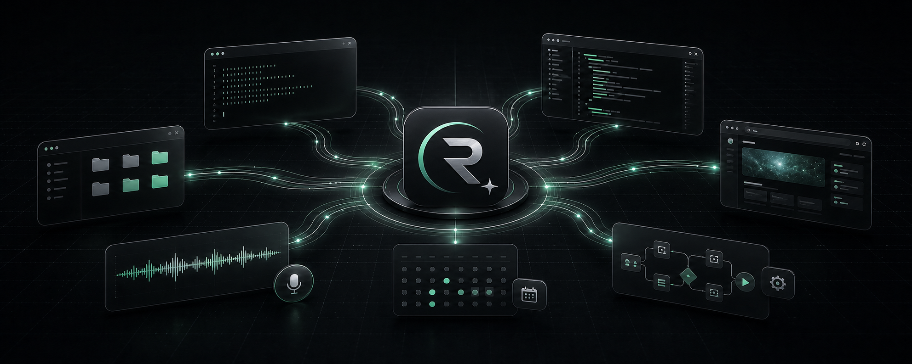
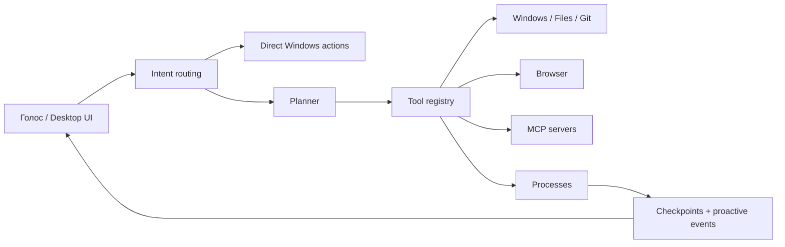

<div align="center">

# Rynne

### Скажи, что должно быть сделано. Rynne разберётся, какие окна, файлы и инструменты для этого нужны.

**Локальный OS-агент для Windows, который не просто отвечает — он действует на вашем компьютере.**

[](#быстрый-старт)
[](#быстрый-старт)
[](#проверка)
[](#контроль-и-безопасность)

[Сайт](https://rynne-web.vercel.app/) · [Скачать для Windows](https://github.com/KremlevLev/Rynne/releases/latest)

[English](README.md) · **Русский**

</div>



<div align="center">

**Голос · окна · файлы · терминал · браузер · память · MCP · фоновые планы**

</div>

---

## Не ещё один чат. Исполнитель.

Обычному ассистенту вы объясняете задачу, получаете инструкцию и всё равно
делаете работу сами. Rynne получает цель, выбирает подходящие инструменты,
выполняет шаги и показывает, что получилось.

> **«Открой проект, запусти тесты, покажи ошибки и не потеряй процесс, пока я
> занимаюсь другим».**

Rynne может открыть приложения, работать с файлами, запустить команду в фоне,
следить за процессом, продолжить план после перезапуска и сообщить, когда
результат готов.

| Обычный AI-чат | Rynne |
|---|---|
| Пишет, куда нажать | Нажимает через API или UI Automation |
| Даёт команду для терминала | Запускает и контролирует процесс |
| Забывает задачу после закрытия | Сохраняет checkpoints фоновых планов |
| Видит только prompt | Работает с окнами, файлами, браузером и MCP |
| Говорит «не могу» без доступного действия | Ищет подходящий инструмент и объясняет реальный blocker |

## Одна фраза → законченный workflow

```text
Вы:   «Запусти проект, прогони тесты и скажи, если сервер упадёт»

Rynne: понимает цель
      → выбирает terminal + process tools
      → запускает работу в фоне
      → сохраняет состояние
      → следит за тестами и сервером
      → возвращается с результатом
```

Не нужно помнить названия инструментов или вручную собирать цепочку команд.
Вы описываете результат человеческим языком.

## Что Rynne уже умеет

### Управлять Windows

- Открывать одно или сразу несколько приложений.
- Сворачивать и закрывать окна, менять громкость.
- Находить элементы интерфейса через UI Automation и нажимать их.
- Распознавать текст на экране через OCR.
- Принимать голосовую команду по `Ctrl+Shift+Space`.

```text
«Открой блокнот, калькулятор и проводник»
«Найди кнопку “Сохранить” в активном окне и нажми её»
«Распознай текст на экране»
```

### Работать как инженерный агент

- Автоматически понимать активный Git/workspace по IDE, терминалу и файлам.
- Выполнять относительные terminal/file/Git-команды именно в этом проекте.
- Читать, создавать и изменять файлы с backup и diff.
- Отменять последние изменения Rynne командой «верни как было», не затирая более свежие ручные правки.
- Проверять Git status, diff, log, ветки и делать commit.
- Запускать команды, тесты и долгоживущие процессы.
- Читать stdout/stderr, проверять health и останавливать дерево процессов.
- Управлять Playwright-браузером.

```text
«Запусти тесты здесь» — полный путь к проекту указывать не нужно
«Отмени последнее изменение Rynne» — восстановится точный проверенный backup
«Покажи изменения в проекте и предложи название коммита»
«Запусти python -m pytest в фоне и покажи итог»
«Подними HTTP-сервер на 8000 и следи, чтобы он не упал»
```

### Помнить и продолжать

- Хранить долговременные факты локально в SQLite.
- Создавать многошаговые и фоновые планы.
- Сохранять checkpoint после каждого подтверждённого шага.
- Продолжать незавершённый план после перезапуска без повтора side effects.

### Распараллеливать сложную работу между моделями

- Rynne автоматически замечает многосоставные инженерные и исследовательские задачи.
- Intent-guardian, архитектор и проверяющий работают независимо и параллельно.
- Параллелизм зависит от здоровых независимых ключей/квот Groq, OpenRouter и Gemini
  и ограничивается настройкой `NOVA_MAX_SUBAGENTS`.
- Reviewer собирает выводы без подмены исходной цели, а реальные инструменты,
  permissions и проверка результата остаются у главной Rynne.
- Создавать напоминания.

```text
«Запомни, что рабочие репозитории лежат в D:\Projects»
«Запусти в фоне план: открой проект, прогони тесты, собери отчёт»
«Напомни через 20 минут проверить сборку»
```

### Быть проактивной, но не самовольной

В настройках есть opt-in режим **«Rynne рядом»**. Когда он включён, Rynne
изредка анализирует только активное окно и может сама спросить:

> «Похоже, сборка упала. Разобраться с ошибкой?»

Кнопка под предложением превращает его в обычный пользовательский запрос.
Регистрация на сайте, ответ в мессенджере, публикация или другое внешнее
действие проходят через стандартный orchestrator, preview и permission policy.
Само наблюдение никогда не получает инструменты.

Rynne сообщает, когда:

- в активном окне появилась явная ошибка, блокер или полезный момент для помощи;
- завершился фоновый план или тесты;
- упал управляемый сервер;
- CPU или RAM остаются перегруженными несколько измерений подряд — с указанием процесса-виновника;
- на диске заканчивается место;
- одноразовый процесс подозрительно долго остаётся запущенным;
- в Git появился конфликт или изменения давно не закоммичены;
- failed-план можно безопасно продолжить с последнего checkpoint;
- повторяющуюся последовательность действий стоит сохранить как workflow;
- явно отслеживаемая публичная страница изменилась;
- резервная копия пропала или устарела;
- для установленного Python-пакета вышла новая версия.

Уведомления имеют cooldown, quiet hours, уровень важности и объяснимую
причину. Rynne предлагает действие, но не выполняет новый side effect без
запроса пользователя.

```text
«Следи за https://example.com/releases и сообщи, когда страница изменится»
«Покажи сайты, за которыми ты следишь»
«Удали подписку watch_...»
«Следи за D:\Backups и предупреди, если backup старше 24 часов»
«Покажи контроль резервных копий»
«Следи за обновлениями пакета requests»
```

Для поиска повторов сохраняются только названия инструментов, случайные
operation/turn/session ID и время. Аргументы, пути, сообщения и результаты не
попадают в эту историю; записи старше configured lookback удаляются.

## Почему Rynne реже отвечает «я не могу»

Инструменты регистрируются в общем capability registry. Роутер выбирает их по
намерению задачи, а не заставляет одну модель угадывать всё сразу.

- Частые Windows-команды выполняются напрямую, без лишнего LLM-вызова.
- Для сложной задачи Rynne строит план и вызывает инструменты по шагам.
- MCP-инструменты подключаются к тому же registry.
- Ошибки инструментов возвращаются как структурированный результат, а не
  маскируются общим отказом.
- Опасные операции проходят через permission policy.

## Модели и маршрутизация

Для Groq маршрут намеренно ограничен двумя моделями:

| Запрос | Модель |
|---|---|
| Текст, рассуждение и tool calling | `openai/gpt-oss-120b` |
| Запрос с изображением | `qwen/qwen3.6-27b` |

OpenRouter может использоваться как резервный провайдер. Rynne не отправляет
текстовый tool-call в случайную маленькую модель ради формального fallback.

## Быстрый старт

### 1. Клонируйте Rynne

```powershell
git clone https://github.com/KremlevLev/nova.git
cd nova
```

### 2. Создайте окружение

```powershell
py -3.14 -m venv .venv
.\.venv\Scripts\Activate.ps1
python scripts/install_dependencies.py
python -m playwright install chromium
```

### 3. Добавьте ключ

```powershell
Copy-Item .env.example .env
```

Минимальный `.env`:

```env
GROQ_API_KEYS=gsk_your_key
```

Ключ Groq создаётся в [console.groq.com](https://console.groq.com/keys).
Для резервного маршрута можно также задать:

```env
OPENROUTER_API_KEYS=sk-or-your_key
```

### 4. Запустите

```powershell
python -m main
```

Нажмите **`Ctrl+Shift+Space`** и скажите:

> **«Открой блокнот и напиши: Rynne работает».**

## Горячие клавиши

| Клавиша | Действие |
|---|---|
| `Ctrl+Shift+Space` | Включить или выключить голосовой режим |
| `Esc` | Прервать речь Rynne |
| `Ctrl+Shift+Q` | Аварийно прервать речь Rynne |

## Desktop UI

Весь desktop-интерфейс доступен на **русском и английском**. Язык переключается в
верхней панели или настройках, сохраняется между запусками и применяется даже к экрану
загрузки до старта React. В разделе **«Памятка»** находится подробное руководство из
восьми частей: быстрый старт, инструменты и task ledger, голос, «Rynne рядом», skills,
провайдеры и MCP, безопасность и диагностика — с готовыми примерами команд на обоих языках.

Озвучка настраивается независимо от языка интерфейса. В Settings доступны Auto/RU/EN,
скорость 0.7–1.6×, пять локальных русских голосов Silero, шесть английских голосов Groq
Orpheus, стили речи и кнопка предпрослушивания у каждого голоса. Groq получает нативный
числовой параметр скорости API, а локальный Silero использует собственные SSML-ступени
`x-slow/slow/normal/fast/x-fast`. Rynne больше не ускоряет уже готовую запись, поэтому
изменение темпа не добавляет металлический эффект постобработки. Такое разделение не
перегружает ноутбук: русский работает локально, а английский использует существующий пул
Groq-ключей без второй нейросети в оперативной памяти.

Основной desktop-интерфейс Rynne построен на React + TypeScript + Tauri. Он даёт
один центр управления:

- диалог и история выполнения;
- фоновые процессы и их логи;
- память;
- разрешения для рискованных действий;
- состояние моделей и провайдеров;
- proactive-уведомления и причины их появления.

React + TypeScript отвечают за presentation layer, Tauri — за нативное окно и
установщик, а AI-ядро остаётся в Python. Старые PySide6-модули сохраняются только
как legacy-код и не запускаются вместе с основным desktop-приложением.

### Обычная установка на Windows

Пользователю нужен только один файл:

```text
Rynne_1.0.0_x64-setup.exe
```

Запустите installer обычным двойным кликом. Rynne установится для текущего
пользователя в `%LOCALAPPDATA%\Rynne`, появится в меню «Пуск» и в списке
установленных программ. Python, Node.js и Rust на пользовательском компьютере
не требуются.

При первом старте без API-ключа приложение не падает: откройте «Настройки»,
выберите Groq/OpenRouter/Gemini и вставьте ключ. Rynne сохранит его в
пользовательских данных приложения и сама переподключит Core.

### Запуск для разработки

Для локального просмотра кликабельного dev-сценария:

```powershell
cd apps\desktop
npm install
npm run dev
# открыть http://127.0.0.1:1420/?demo=1
```

Без `?demo=1` браузерный preview честно показывает отсутствие Tauri Core.
JSONL bridge и supervisor уже реализованы, но полноценный desktop-запуск
проверяется отдельной командой:

```powershell
cd C:\Users\Utest\Desktop\rynne
.\scripts\dev-desktop.ps1
```

Скрипт сам находит локальную Vosk-модель, включает wake word, запускает Vite,
открывает нативное окно Tauri и поднимает Python Core. Если русской small-модели
ещё нет, один раз выполните `python -m vosk_install` или запустите
`.\scripts\dev-desktop.ps1 -InstallWakeWord`.

Отдельная проверка микрофона, аудиоформата и Vosk без запуска Rynne:

```powershell
python scripts\voice_diagnostics.py
python scripts\voice_diagnostics.py --listen 20
```

Не запускайте `npm run dev` одновременно: оба процесса попытаются занять порт `1420`.

### Сборка Windows installer

Один раз установите build dependencies:

```powershell
python -m pip install -r requirements-build.txt
cd apps\desktop
npm install
```

Затем:

```powershell
$env:Path = "$env:USERPROFILE\.cargo\bin;$env:Path"
npm run installer
```

Команда собирает React, упаковывает headless Python Core через PyInstaller,
собирает Tauri release и создаёт:

```text
apps\desktop\src-tauri\target\release\bundle\nsis\Rynne_1.0.0_x64-setup.exe
```

Core использует source fingerprint: повторная сборка пропускает PyInstaller,
если Python-ядро не менялось. Для принудительной пересборки:

```powershell
npm run build:core -- --force
```

Подробнее: [`docs/desktop_architecture.md`](docs/desktop_architecture.md).

## MCP: подключите рабочие сервисы

### Telegram Business Bot (рекомендуется)

Создайте бота через `@BotFather`, включите ему Business Mode, подключите его к
своему аккаунту Telegram и вставьте Bot Token в **Настройки → Интеграции**.
Rynne будет получать разрешённые новые сообщения, хранить локальный кэш и после
подтверждения отвечать от имени подключённого аккаунта. Bot API не отдаёт
произвольную старую историю: диалог появляется после нового события, полученного
ботом. На том же экране можно добавить Tavily API Key для более качественного
поиска в интернете.

### Постоянно доступный Telegram Remote (опциональное облако)

Приватный `rynne-cloud` может постоянно принимать Telegram webhook и хранить
очередь задач. Команды `/status`, `/tasks`, `/last`, `/cancel` и `/devices`
работают даже при выключенном ПК. Обычная задача остаётся в очереди и будет
передана Core после подключения. Core делает только исходящие HTTPS-запросы, а
облако не может обойти локальный режим разрешений или само запускать Windows tools.

```env
RYNNE_CLOUD_REMOTE_URL=https://your-private-relay.vercel.app
RYNNE_CLOUD_DEVICE_ID=windows-primary
RYNNE_CLOUD_DEVICE_TOKEN=replace-with-the-device-token
```

### Личный Telegram через MCP (расширенный режим)

В Rynne теперь есть опциональный локальный Telegram MCP для обычного аккаунта,
а не бота. Он умеет находить чаты, читать и искать сообщения и отправлять ответ
без угадывания координат на экране. Один раз авторизуйте сессию и перезапустите
Core:

```powershell
py -m pip install -r requirements.txt
py scripts/setup_telegram_mcp.py
```

Сессия остаётся на этом компьютере. Чтение выполняется без лишних вопросов, а
перед отправкой Rynne следует выбранному режиму разрешений: без запроса, только для рискованных действий или перед каждым инструментом. Для визуального
открытия диалога остаётся Chrome-skill: MCP работает с данными, UI-skill — с
видимым окном.

Rynne поддерживает `stdio`, Streamable HTTP и legacy SSE через официальный MCP
Python SDK. Конфиг совместим с форматом `mcpServers`:

```env
NOVA_MCP_CONFIG=C:\Users\you\.config\nova\mcp.json
NOVA_MCP_AUTO_DISCOVERY=false
```

```json
{
  "mcpServers": {
    "project_files": {
      "command": "python",
      "args": ["C:\\tools\\project_server.py"],
      "env": {
        "PROJECT_TOKEN": "${PROJECT_TOKEN}"
      }
    },
    "internal_api": {
      "transport": "streamable_http",
      "url": "http://127.0.0.1:8000/mcp"
    }
  }
}
```

После handshake инструменты получают risk/category metadata и участвуют в
общем capability routing. Значения `${ENV_NAME}` подставляются локально и не
добавляются в prompt.

## Научите Rynne новому workflow без пересборки

Rynne по требованию загружает контекстные Markdown-skills из
`%USERPROFILE%\.nova\skills`, `<workspace>\.nova\skills` и совместимого пути
`<workspace>\.agents\skills`. Создайте в подпапке файл `SKILL.md`:

```markdown
---
name: Release Project
triggers: [релиз, опубликуй версию]
paths: [package.json, pyproject.toml]
tools: [read_text_file, apply_text_patch, run_project_tests, git_commit]
---
Прочитай текущую версию, запусти ближайшие тесты, обнови changelog и создай
коммит. Никогда не публикуй релиз, если тесты упали.
```

В контекст попадают только подходящие skills. Проектное правило переопределяет
глобальное с тем же именем и обновляется сразу после сохранения; перечисленные
tools подгружаются из общего registry. Skill не может отменить policy,
permissions, подтверждения Rynne или явную цель пользователя.

## Контроль и безопасность

OS-агент не должен быть «магией», которой приходится слепо доверять.

- Рискованные операции требуют подтверждения.
- Python-код выполняется в sandbox.
- Запись в системные каталоги ограничена.
- Fallback не повторяет уже выполненный side effect.
- Фоновые действия и причины proactive-предложений журналируются.
- «Rynne рядом» выключена по умолчанию: при наблюдении кадр остаётся в RAM и в vision-модель уходит только активное окно.
- После клика «Помочь» визуальный контекст создаётся как одноразовый attachment и удаляется сразу после чтения агентом.
- Окна password manager, банков, оплаты и private browsing автоматически пропускаются.
- Содержимое экрана считается недоверенным и проверяется на prompt injection.
- MCP auto-discovery выключен по умолчанию.
- Секреты остаются в `.env` и environment variables.

Порог свободного места и quiet hours настраиваются:

```env
NOVA_PROACTIVE_QUIET_START=22
NOVA_PROACTIVE_QUIET_END=8
NOVA_PROACTIVE_DISK_FREE_PERCENT=10
NOVA_PROACTIVE_DISK_FREE_GB=5
NOVA_PROACTIVE_SYSTEM_CHECK_SECONDS=15
NOVA_PROACTIVE_CPU_PERCENT=90
NOVA_PROACTIVE_MEMORY_PERCENT=88
NOVA_PROACTIVE_SYSTEM_CONSECUTIVE_SAMPLES=4
NOVA_PROACTIVE_VISION_CHECK_SECONDS=90
NOVA_PROACTIVE_VISION_MIN_CONFIDENCE=0.78
NOVA_PROACTIVE_STALE_PROCESS_HOURS=4
NOVA_PROACTIVE_REPOSITORY_CHECK_SECONDS=60
NOVA_PROACTIVE_UNCOMMITTED_MINUTES=30
NOVA_PROACTIVE_RESUME_PLAN_MINUTES=15
NOVA_PROACTIVE_WORKFLOW_LOOKBACK_DAYS=14
NOVA_PROACTIVE_WORKFLOW_MIN_REPETITIONS=3
NOVA_PROACTIVE_WEBSITE_CHECK_SECONDS=300
NOVA_PROACTIVE_BACKUP_CHECK_SECONDS=300
NOVA_PROACTIVE_PACKAGE_CHECK_SECONDS=21600
NOVA_PROACTIVE_DISABLED_KINDS=disk_space_low,tests_completed
```

## Как это устроено



```text
nova/
├── apps/
│   └── desktop/       React/TypeScript UI и Tauri Windows shell
├── core/              конфигурация и системные правила
├── modules/
│   ├── agent/         планы, background tasks, proactive engine
│   ├── application/   request pipeline и отчёты
│   ├── audio/         STT и TTS
│   ├── brain/         LLM gateway и model routing
│   ├── browser/       Playwright
│   ├── storage/       SQLite, память, checkpoints, artifacts
│   ├── tools/         registry, runner, policies
│   ├── ui/            PySide6 Desktop UI и overlay
│   └── windows/       процессы, файлы, Git, UIA, OCR
├── tests/
├── main.py
└── roadmap.md
```

## Проверка

```powershell
python -m pytest -q
cd apps\desktop
npm test
npm run build
```

Текущий regression suite: **887 Python-тестов + 24 desktop-теста + 8/8 acceptance-сценариев оркестратора**.

Для проверки именно оркестратора без Groq, сети и реальных действий:

```powershell
python -m tests.orchestrator_acceptance
```

Golden-сценарии прогоняют production selector, tool schemas, registry, policy,
runtime validation и события выполнения. Все handlers заменены безопасными
recorders: приложения, файлы, терминал и сайты фактически не затрагиваются.
Новая capability добавляется одной записью в `GOLDEN_SCENARIOS` внутри
[`tests/orchestrator_acceptance.py`](tests/orchestrator_acceptance.py).

## Статус проекта

Rynne активно развивается. Уже работают OS-инструменты, durable background
plans, MCP layer, desktop UI, память, безопасная проактивность и параллельные
read-only команды субагентов. Дальше — изолированные worktree для параллельного
написания кода, расширение proactive-сценариев и автоматические обновления.

Подробный и честный backlog находится в [`roadmap.md`](roadmap.md).

## Лицензия

Версии Rynne, содержащие текущий файл [`LICENSE`](LICENSE), распространяются по **Functional Source License 1.1, Apache 2.0 Future License** (`FSL-1.1-ALv2`). Разрешены личное и внутреннее использование, обучение, исследования, модификация и распространение в допустимых целях. Предоставлять Rynne или практически аналогичную функциональность как конкурирующий коммерческий продукт или сервис условия FSL не разрешают.

Эта модель лицензирования применяется к покрытым версиям, впервые опубликованным **10 августа 2026 года** или позднее. Каждая такая версия переходит под Apache License 2.0 через два года после даты её первой публикации. Ранее опубликованные под Apache 2.0 версии сохраняют исходную лицензию.

Условия для конкурирующего продукта, managed service, OEM или white-label описаны в документе [«Коммерческое лицензирование»](COMMERCIAL-LICENSE.md). Предлагаемая граница между полноценным публичным desktop-агентом и закрытой инфраструктурой Rynne Cloud описана в [open-core архитектуре](docs/open-core-boundaries.md).

Если вам нужен Windows-агент, которому можно не только задать вопрос, но и
передать реальную задачу — попробуйте Rynne и расскажите, на каком workflow она
должна экономить ваше время следующей.
